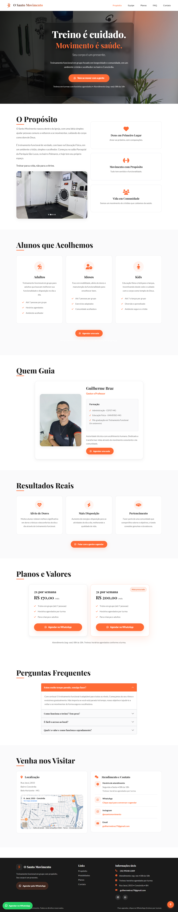

# O Santo Movimento - Treinamento Funcional 🏋️‍♂️✨

  

Este projeto é a landing page oficial do **O Santo Movimento**, um estúdio de treinamento funcional localizado no bairro Concórdia, em Belo Horizonte. O site foi construído para transmitir os valores de comunidade, saúde e propósito cristão que regem o estúdio.

## 🎯 Objetivo do Projeto
O foco principal foi criar uma interface que convertesse visitantes em alunos, facilitando o agendamento de aulas experimentais e apresentando de forma clara as modalidades (Adultos, Idosos e Kids) e os planos de assinatura.

## 🚀 Tecnologias e Conceitos
- **Desenvolvimento Web:** HTML, CSS, JS.
- **Copywriting Estratégico:** Textos focados em acolhimento e resultados reais (alívio de dores, disposição e pertencimento).
- **UX/UI Design:** Layout limpo com cores que transmitem energia e sobriedade, totalmente responsivo para dispositivos móveis.
- **Componentes:**
  - Carrossel de fotos da estrutura física.
  - Seção de FAQ (Perguntas Frequentes) para quebrar objeções.
  - Integração direta com WhatsApp para agendamento de turmas.

## 📂 Funcionalidades
- **Apresentação do Propósito:** Seção dedicada à história e valores da marca.
- **Divisão de Modalidades:** Cards informativos para diferentes públicos.
- **Tabela de Planos:** Exposição clara de valores e benefícios.
- **Localização Integrada:** Endereço e contatos centralizados.

## 🌐 Link do Projeto
Confira o resultado final: [santomovimento.com.br](https://santomovimento.com.br/)

---
Desenvolvido por **Maisa Rodrigues**
